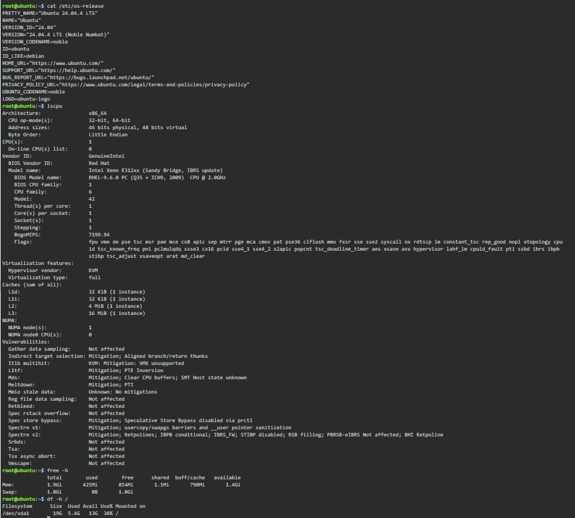

## Checkpoint 7 – Continue Your Linux Investigation

### Linux Server Information

| Information | Result |
|---|---|
| Operating System | Ubuntu 24.04.4 LTS (Noble Numbat) |
| CPU | Intel Xeon E312xx (Sandy Bridge, IBRS update) |
| CPU Count | 1 |
| Memory | 1.9 GiB |
| Disk Space | 19 GB |
| Disk Used | 5.4 GB |
| Disk Available | 13 GB |
| Disk Usage | 30% |

### Cloud Migration

If this Linux server were migrated to the cloud, it could be hosted using virtual machine services provided by AWS, Microsoft Azure, and Google Cloud Platform.

| Cloud Provider | Cloud Service |
|---|---|
| AWS | Amazon EC2 |
| Microsoft Azure | Azure Virtual Machines |
| Google Cloud Platform | Compute Engine |

#### AWS – Amazon EC2

Amazon EC2 can host Linux-based virtual machines in the AWS cloud. The server can be configured with appropriate computing, memory, and storage resources depending on the workload.

#### Microsoft Azure – Azure Virtual Machines

Azure Virtual Machines can host Linux operating systems in Microsoft's cloud environment. The virtual machine can be configured based on the required CPU, memory, and storage resources.

#### Google Cloud Platform – Compute Engine

Google Compute Engine provides virtual machines that can run Linux operating systems. It allows users to configure the virtual machine's computing resources according to the workload requirements.

### Conclusion

The Linux server can be migrated to AWS, Microsoft Azure, or Google Cloud Platform because all three providers offer virtual machine services that support Linux workloads. The final choice would depend on factors such as cost, performance, existing infrastructure, and business requirements.

### Terminal Evidence

