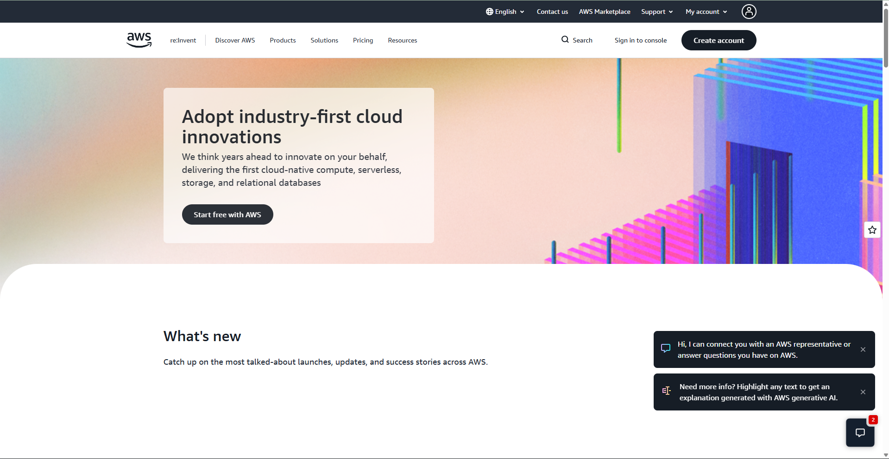

# AWS Research

## 1. Brief Overview

Amazon Web Services (AWS) is a cloud computing platform that provides a wide range of infrastructure and application services through the internet. Organizations can use AWS to build, deploy, store, and manage applications without having to maintain all of the underlying physical infrastructure themselves.

## 2. Global Infrastructure

AWS operates a global infrastructure organized into geographic Regions and Availability Zones. A Region is a separate geographic area, while Availability Zones are isolated locations within a Region. AWS designs Regions with multiple Availability Zones to support high availability and fault tolerance. 

## 3. Cloud Management Console

The AWS Management Console is a web-based interface used to access and manage AWS services and resources. Administrators can use the console to create, configure, monitor, and manage cloud resources.

## 4. Four Core Services

1. **Amazon EC2** – Provides resizable virtual servers for running applications.
2. **Amazon S3** – Provides object storage for files and other types of data.
3. **Amazon VPC** – Provides networking capabilities for creating isolated virtual networks.
4. **AWS IAM** – Controls access to AWS resources and helps manage identities and permissions.

## 5. Three Advantages

1. **Scalability** – Resources can be increased or decreased according to workload requirements.
2. **Global Infrastructure** – AWS provides infrastructure across many geographic regions.
3. **Wide Range of Services** – AWS provides many services for computing, storage, networking, databases, security, and other workloads.

## 6. Typical Enterprise Use Cases

AWS can be used by enterprises for web and mobile applications, data storage, backup and disaster recovery, databases, enterprise applications, and large-scale workloads.

## 7. Screenshot

## 8. Sources

- Amazon Web Services. AWS Global Infrastructure.
- Amazon Web Services. AWS Management Console.
- Amazon Web Services. AWS Services Documentation.
