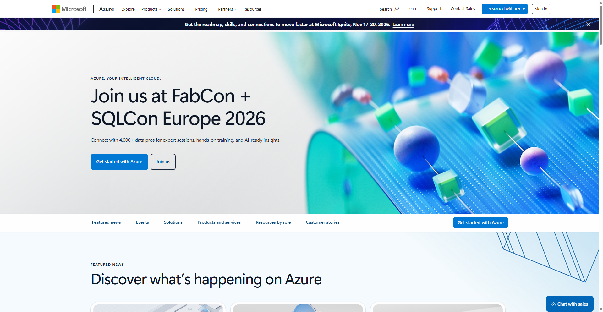

# Microsoft Azure Research

## 1. Brief Overview

Microsoft Azure is a cloud computing platform provided by Microsoft. It offers cloud services for computing, storage, networking, databases, artificial intelligence, analytics, security, and application development.

## 2. Global Infrastructure

Azure organizes its infrastructure into geographies, regions, and Availability Zones. Azure regions provide locations where organizations can deploy cloud resources, while Availability Zones are physically and logically separated datacenters designed to support highly available applications.

## 3. Cloud Management Console

The Azure portal is a web-based unified console used to create, manage, monitor, and configure Azure resources. It provides a graphical interface for managing cloud services and subscriptions.

## 4. Four Core Services

1. **Azure Virtual Machines** – Provides virtual machines for running applications and workloads.
2. **Azure Blob Storage** – Provides object storage for large amounts of unstructured data.
3. **Azure Virtual Network** – Provides networking capabilities for Azure resources.
4. **Microsoft Entra ID** – Provides identity and access management for users and resources.

## 5. Three Advantages

1. **Microsoft Integration** – Azure integrates well with Microsoft technologies and services.
2. **Hybrid Cloud Capabilities** – Azure supports organizations that use both on-premises and cloud infrastructure.
3. **Global Infrastructure** – Azure provides cloud infrastructure across many geographic regions.

## 6. Typical Enterprise Use Cases

Azure can be used for enterprise applications, Microsoft workloads, hybrid cloud environments, virtual machines, databases, application development, data analytics, and artificial intelligence.

## 7. Screenshot

