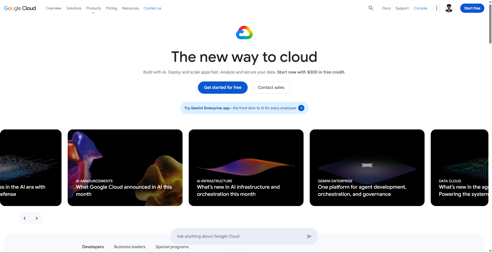

# Google Cloud Platform Research

## 1. Brief Overview

Google Cloud Platform (GCP), commonly called Google Cloud, is a cloud computing platform that provides infrastructure, application development, data analytics, artificial intelligence, storage, networking, and other cloud services.

## 2. Global Infrastructure

Google Cloud organizes its infrastructure into regions and zones. Regions are independent geographic areas, while zones are deployment areas within regions. Organizations can select locations based on requirements such as latency, availability, and data residency.

## 3. Cloud Management Console

The Google Cloud Console is a web-based interface used to manage Google Cloud resources and services. Users can create, configure, monitor, and manage cloud resources through the console.

## 4. Four Core Services

1. **Compute Engine** – Provides virtual machines for running workloads.
2. **Cloud Storage** – Provides object storage for data and files.
3. **Google Kubernetes Engine (GKE)** – Provides managed Kubernetes for deploying containerized applications.
4. **Cloud IAM** – Controls access to Google Cloud resources through identities and roles.

## 5. Three Advantages

1. **Artificial Intelligence and Machine Learning** – Google Cloud provides strong AI and machine learning capabilities.
2. **Kubernetes** – Google Cloud provides Google Kubernetes Engine for managed Kubernetes deployments.
3. **Global Network** – Google Cloud provides global infrastructure designed for performance and low latency.

## 6. Typical Enterprise Use Cases

Google Cloud can be used for artificial intelligence and machine learning, data analytics, containerized applications, web applications, virtual machines, databases, and large-scale data processing.

## 7. Screenshot

## 8. Sources

- Google Cloud. Global Infrastructure.
- Google Cloud. Google Cloud Console Documentation.
- Google Cloud. Products and Services Documentation.
